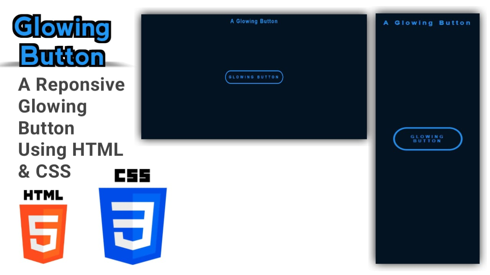

# Glowing Button Project

## Demo Screenshot

## Live Demo

* You can check out the live demo of the project here: [Glowing Button]()

## Table of Contents
1. [Project Overview](#project-overview)
2. [Description](#description)
3. [Features](#features)
4. [Technologies Used](#technologies-used)
5. [Usage](#usage)
6. [Contributing](#contributing)
7. [Contact](#contact)

## Project Overview

This project consists of a simple interactive button with a glowing effect that enhances the user interface of any web page.

## Description

This project includes one HTML document and one CSS document:

1. **index.html**: 
- Contains a button with a glowing effect.
- The glowing effect is achieved using CSS properties.

2. **style.css**:
- Styles the button to create the glowing effect, including hover transitions.

## Features

- **Glowing Button Effect**: When the user hovers over the button, it glows, providing a visually appealing interaction.
- **Customizable**: You can easily change the color, size, and glow intensity by tweaking the CSS.
- **Responsive Design**: The button adapts to various screen sizes for better user experience.

## Technologies Used

- **HTML5**: For structuring the content.
- **CSS3**: For styling and creating the glowing animation.

## Usage

- Open the `index.html` file in any web browser to view the glowing button.
- Customize the button's appearance by editing the `style.css` file as per your needs.

## Contributing

If you have suggestions for improvements or bug fixes, feel free to create a pull request or open an issue.

## Contact

For any questions or comments, please reach out to:
- Email: [premkumar224487@gmail.com](mailto:premkumar224487@gmail.com)
- GitHub: [premkrrajbhar](https://github.com/premkrrajbhar)
